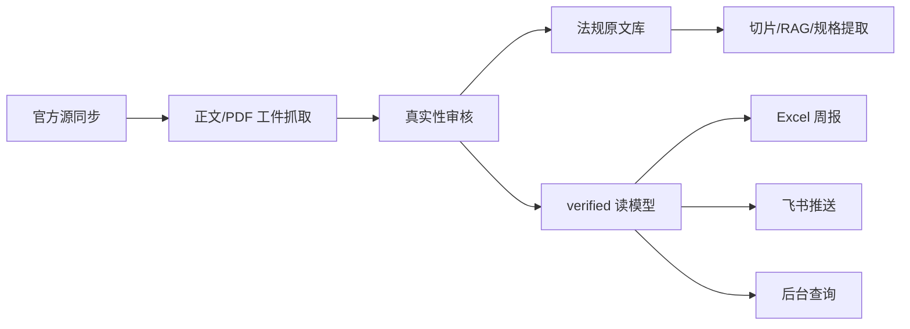

# 网安合规助手

面向海外网络设备业务的官方证据驱动合规平台。

系统目标是每周自动更新全球网络安全法规与认证数据，基于官方来源下载 PDF/正文页，经过真实性审核后生成合规知识库、Excel 周报，并自动发送到飞书群。AI 只用于辅助解析本地官方文件、提取规格和基于切片问答，不允许 AI 联网结论直接进入正式库。

## 当前主线



## 核心边界

- 正式知识只来自 `verified` 官方证据，不从 AI 搜索摘要直接生成。
- `candidate` 只是候选池，默认不进入后台正式清单、RAG、周报和飞书查询。
- `suspicious` 仅供内部审核继续处理，不作为正式结论输出。
- `quarantined` 默认隔离，不参与任何业务查询。
- PDF/HTML 原文入库后，AI 才能基于本地文本切片做解析、问答和规格提取。

## 项目结构

```text
cybersec-compliance/
├── admin/                 # FastAPI 后台接口 + Vue 管理台
├── collector/
│   ├── official_sources/  # 官方源发现、工件抓取、候选入库
│   └── document/          # PDF/HTML 提取、切片、索引、规格生成
├── database/              # 连接、模型、SQL 迁移
├── feishu_bot/            # 飞书查询与卡片
├── notifier/              # 飞书 Webhook 推送
├── reporter/              # verified-only Excel 周报
├── scheduler/             # 每周完整更新与分层调度任务
├── scripts/               # 部署、诊断、legacy 保护脚本
└── tests/                 # 单元与集成测试
```

## 快速开始

```bash
python3 -m venv .venv
source .venv/bin/activate
pip install -r requirements.txt

cp config/.env.example config/.env
# 编辑 config/.env，配置数据库、COS、AI 网关和飞书 Webhook。

python scripts/init_db.py
uvicorn admin.api.main:app --host 0.0.0.0 --port 8080
python scheduler/main.py
```

管理后台默认入口：

- `http://49.235.162.135:8080/`
- `Tasks` 页面可手动触发“每周完整更新”。
- `Documents` 页面用于上传/解析官方原文。
- `Research` 页面用于 verified-only RAG 问答。
- `Reviews` 页面用于候选真实性审核和人工补源。

## 每周更新

每周完整任务固定执行以下链路：

1. 同步 P1/P2/P3 官方源候选。
2. 抓取官方 PDF 或稳定正文页工件。
3. 对候选进行证据分桶和真实性审核辅助。
4. 解析 verified 文档并重建 RAG/规格基础数据。
5. 刷新 `compliance_index` verified 读模型。
6. 生成 Excel 周报并发送飞书群。

可通过后台 `Tasks` 页面触发，也可调用：

```http
POST /api/tasks/trigger/weekly-compliance-update
```

## Legacy 约束

`scripts/run_full_update.py` 和 `scripts/ai_verify.py` 是旧 AI 搜索链路，默认已禁用。除临时排障并显式传入 `--legacy-unsafe` 外，不应运行它们。新的正式数据生产路径只走官方源、工件、审核和读模型刷新。
