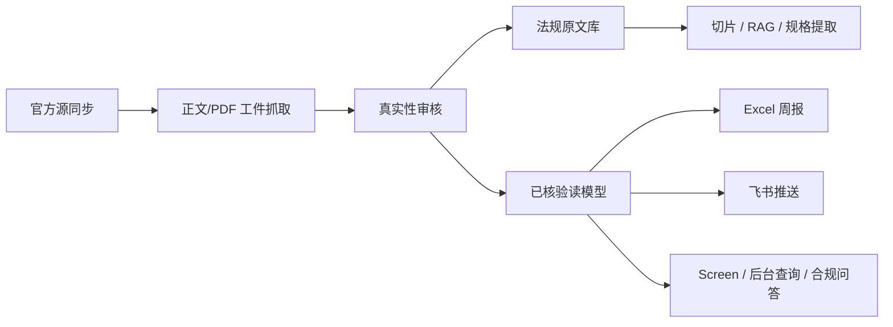

# 网安合规助手

这是一个面向海外网络设备业务的网安合规知识库和自动化运营系统。

它做的事情比较明确：持续收集全球网络安全相关法规、认证、标准和官方证据，沉淀成可查询的知识库；同时支持地图看板、后台审核、合规问答、规格提取、Excel 报告和飞书推送。

这个项目最重要的原则是：正式数据必须有官方来源。法规、认证和标准只有在拿到官方正文页、官方 PDF、官方公报、监管机构或标准机构页面后，才会进入正式库。AI 可以辅助解析文件、整理规格和回答问题，但不能把联网摘要直接写成正式结论。

## 获取代码

这个仓库如果是公开状态，直接 clone 即可：

```bash
git clone https://github.com/iamyourhang/cybersec-compliance.git
```

如果你把它改成私有仓库，只需要给实际使用的人加 GitHub collaborator，或者给服务器配置只读 Deploy Key。普通使用者只需要读权限；生产环境的 API Key、COS 密钥、飞书 Webhook 都放在各自服务器的 `.env` 里，不需要也不应该提交到仓库。

## 核心链路



## 数据边界

- `verified`：已核验数据，可进入正式清单、Screen、RAG、规格库、Excel 和飞书。
- `candidate`：候选线索，不作为正式结论输出。
- `suspicious`：证据不足或待复核，仅后台内部可见。
- `quarantined`：隔离数据，不参与默认查询和问答。
- AI 回答默认只读已核验数据、已入库原文切片和规格库。

## 项目结构

```text
cybersec-compliance/
├── admin/                 # FastAPI 后台接口 + Vue 前端
├── app/security/          # 加密、密钥辅助逻辑
├── collector/
│   ├── official_sources/  # 官方源发现、工件抓取、候选入库
│   ├── document/          # PDF/HTML 提取、切片、索引、RAG、规格生成
│   ├── discovery/         # AI/规则辅助发现候选
│   ├── providers/         # LLM 通道池与兼容网关
│   └── review/            # 真实性审核服务
├── database/              # 数据库连接、迁移、种子数据
├── feishu_bot/            # 飞书查询机器人
├── notifier/              # 飞书 Webhook 推送
├── reporter/              # Excel 报告生成
├── scheduler/             # 定时任务和批处理入口
├── scripts/               # 初始化、导入、诊断、维护脚本
└── tests/                 # 单元和接口测试
```

## 部署说明

部署后会得到一套完整服务：FastAPI 后台、Vue 前端、PostgreSQL/pgvector 数据库、调度器、飞书推送、COS 工件存储和内置 AI 通道。

仓库里只放代码、迁移脚本和脱敏公共数据包。真实 `.env`、API Key、COS 密钥、飞书 Webhook、运行日志和私有生产数据都需要部署者自己配置。

### 1. 环境要求

推荐环境：

- Ubuntu 22.04/24.04 或其他 Linux 服务器。
- Python 3.11 或以上。
- Node.js 18 或以上。
- PostgreSQL 14 或以上，并启用 `pgvector`。
- 可选：Docker，用于快速启动 PostgreSQL/pgvector。
- 可选：Nginx，用于 HTTPS 和反向代理。

外部服务：

- AI 网关：任一 OpenAI 兼容接口，例如 UniAPI、OpenAI、DashScope、DeepSeek 等。
- Embedding 网关：OpenAI 兼容 embedding 接口，默认维度 `1536`。
- 腾讯云 COS：用于存放法规 PDF/HTML 工件和 Excel 报告。
- 飞书机器人 Webhook：用于发送日报、周报和告警。

### 2. 拉取代码

```bash
git clone https://github.com/iamyourhang/cybersec-compliance.git
cd cybersec-compliance
```

如果要按 systemd 示例部署到固定目录，建议放到 `/opt/cybersec-compliance`：

```bash
sudo mkdir -p /opt
sudo git clone https://github.com/iamyourhang/cybersec-compliance.git /opt/cybersec-compliance
cd /opt/cybersec-compliance
```

公开仓库可以直接拉取；私有仓库需要先确认当前 GitHub 账号有读权限。

### 3. 配置 Python 环境

```bash
python3 -m venv .venv
source .venv/bin/activate
pip install -r requirements.txt
```

### 4. 配置环境变量

```bash
cp config/.env.example config/.env
nano config/.env
```

至少配置数据库、管理员账号和 JWT 密钥：

```dotenv
DB_HOST=localhost
DB_PORT=5432
DB_NAME=cybersec_compliance
DB_USER=compliance_user
DB_PASSWORD=change_me

ADMIN_USERNAME=viewer
ADMIN_PASSWORD=change_me
ADMIN_SUPER_USERNAME=admin
ADMIN_SUPER_PASSWORD=change_me
ADMIN_JWT_SECRET=change_me_to_a_long_random_string
ADMIN_PORT=8080
```

如果需要 AI 问答、解析、规格提取，再配置 OpenAI 兼容通道：

```dotenv
UNIAPI_API_KEY=your_key
UNIAPI_BASE_URL=https://your-openai-compatible-gateway/
UNIAPI_MODEL=your_model

EMBEDDING_API_KEY=your_embedding_key
EMBEDDING_BASE_URL=https://your-embedding-gateway/
EMBEDDING_MODEL=text-embedding-3-small
EMBEDDING_DIMENSIONS=1536
```

如果需要飞书和报告存储，再配置：

```dotenv
FEISHU_WEBHOOK_URL=
FEISHU_WEBHOOK_SECRET=

COS_SECRET_ID=
COS_SECRET_KEY=
COS_BUCKET=
COS_REGION=
COS_REPORT_PREFIX=reports/
```

生成 `LLM_ROUTER_SECRET`：

```bash
python - <<'PY'
from cryptography.fernet import Fernet
print(Fernet.generate_key().decode())
PY
```

把输出写入：

```dotenv
LLM_ROUTER_SECRET=上一步生成的值
```

不要提交真实 `config/.env`。仓库只保留 `config/.env.example`。

### 5. 初始化数据库

如果本机没有 PostgreSQL，推荐先用 Docker 启动一个带 `pgvector` 的本地数据库：

```bash
docker compose up -d postgres
```

然后把 `config/.env` 中数据库配置设为：

```dotenv
DB_HOST=localhost
DB_PORT=5432
DB_NAME=cybersec_compliance
DB_USER=compliance_user
DB_PASSWORD=change_me
```

首次建库：

```bash
python scripts/init_db.py --superuser postgres --superpass postgres --seed
```

如果你使用的是手工安装的 PostgreSQL，把 `--superpass postgres` 改成自己的 PostgreSQL 超级用户密码。

如果数据库和用户已经存在，只执行迁移：

```bash
python scripts/init_db.py --migrate-only
```

如果你有自己的 SQL 或 dump 数据包，可以在迁移完成后导入：

```bash
psql "$DB_DSN" -f data.sql
# 或
pg_restore --dbname "$DB_DSN" backup.dump
```

### 6. 导入公共 verified 数据包

仓库自带 `data/public/` 公共数据包，来自生产库的脱敏 verified-only 快照，包含：

- 已核验网络安全法规、认证、标准记录。
- 官方源白名单、官方原文链接、工件哈希和文档元数据。
- 结构化规格要求和相关中文译文。

数据包不包含：

- 用户、账号、日志、任务历史。
- AI Key、飞书 Webhook、COS 密钥。
- COS 对象 key/URL、原始 PDF/HTML、RAG chunks、embedding。
- `candidate/suspicious/quarantined` 非正式数据。

初始化数据库后导入：

```bash
python scripts/import_public_data.py --dir data/public
```

导入后会自动重建 `review_cases`、`canonical_requirements` 和 `compliance_index` 读模型。原文 PDF/HTML 未随仓库分发，如需 RAG 原文问答，请根据数据里的官方链接重新下载并索引。

当前公共包规模：

```text
国家/地区：199
官方源：246
已核验合规记录：174
文档元数据：263
规格要求：1707
译文：11866
```

### 7. 构建前端

生产模式下 FastAPI 会直接服务 `admin/dist`。首次部署建议先构建：

```bash
cd admin/frontend-vue
npm ci
npm run build
cd ../..
```

构建产物会输出到 `admin/dist`。

### 8. 本地启动验证

```bash
source .venv/bin/activate
uvicorn admin.api.main:app --host 0.0.0.0 --port 8080
```

另开一个终端启动调度器：

```bash
source .venv/bin/activate
python scheduler/main.py
```

访问：

```text
http://<server-ip>:8080/
http://<server-ip>:8080/screen
http://<server-ip>:8080/health
```

### 9. 前端开发模式

如需前端开发：

```bash
cd admin/frontend-vue
npm ci
npm run dev
```

构建前端：

```bash
cd admin/frontend-vue
npm run build
```

构建产物会输出到 `admin/dist`。`admin/dist` 属于构建产物，默认不提交。

### 10. systemd 部署

调度器服务模板在：

```text
scripts/cybersec-compliance.service
```

安装调度器服务：

```bash
sudo cp scripts/cybersec-compliance.service /etc/systemd/system/cybersec-compliance.service
sudo systemctl daemon-reload
sudo systemctl enable cybersec-compliance
sudo systemctl start cybersec-compliance
sudo journalctl -u cybersec-compliance -f
```

后台 API 可新增一个 systemd 服务：

```bash
sudo tee /etc/systemd/system/cybersec-admin.service >/dev/null <<'EOF'
[Unit]
Description=网安合规助手管理后台
After=network.target postgresql.service
Wants=network-online.target

[Service]
Type=simple
WorkingDirectory=/opt/cybersec-compliance
Environment=PYTHONPATH=/opt/cybersec-compliance
Environment=PYTHONUNBUFFERED=1
ExecStart=/opt/cybersec-compliance/.venv/bin/python -m uvicorn admin.api.main:app --host 0.0.0.0 --port 8080 --workers 2
Restart=on-failure
RestartSec=10
StandardOutput=journal
StandardError=journal

[Install]
WantedBy=multi-user.target
EOF

sudo systemctl daemon-reload
sudo systemctl enable cybersec-admin
sudo systemctl start cybersec-admin
sudo journalctl -u cybersec-admin -f
```

### 11. 一键部署脚本

Ubuntu 服务器可以使用：

```bash
sudo bash scripts/deploy.sh
```

脚本会安装系统依赖、启动 PostgreSQL/pgvector、创建 Python 虚拟环境、初始化数据库并注册调度器服务。执行后仍需要编辑：

```bash
nano /opt/cybersec-compliance/config/.env
```

填入 AI、Embedding、COS、飞书和管理员密码后，再启动服务。

## 后台功能入口

- `Screen`：普通用户主入口，全球地图、国家详情、官方证据、合规问答。
- `合规知识库`：查看已核验法规、认证、标准和证据链。
- `法规原文`：上传 PDF/HTML、解析、切片、索引、生成规格。
- `法规问答`：后台高级 RAG 工作台。
- `审核工作台`：候选真实性审核、人工补源、隔离可疑数据。
- `官方源`：维护官方源白名单和同步历史。
- `任务管理`：手动触发官方源同步、工件抓取、文档解析、周报、预警扫描。
- `AI 通道`：维护内置 AI 通道池、优先级和额度耗尽切换。

普通用户默认只能查看知识库、原文、Screen 和问答；管理员可管理审核、任务、官方源和系统配置。

## 常用任务

### 官方源同步

```bash
python -m scheduler.main
```

或在后台 `任务管理` 页面手动触发。

### 上传本地官方原文

后台进入 `法规原文` 页面，上传官方 PDF。系统会按配置执行：

```text
上传文件 -> 提取文本 -> 文档解析 -> 切片 -> 向量/关键词索引 -> RAG 可问答
```

### 本地补源桥

当服务器访问海外官方站点失败时，可在本地下载官方 PDF/HTML，再导入服务器：

```bash
python scripts/local_official_artifact_fetch.py --input pending.jsonl --output local_artifacts/YYYYMMDD
python scripts/import_local_artifacts.py --manifest local_artifacts/YYYYMMDD/manifest.jsonl
```

### 生成 Excel 报告

后台 `任务管理` 页面触发“生成周报”，或调用对应任务接口。报告默认只导出已核验数据。

## 测试

后端测试：

```bash
pytest
```

前端构建检查：

```bash
cd admin/frontend-vue
npm run build
```

Screen 问答前端检查：

```bash
cd admin/frontend-vue
npm run test:screen-agent
```

## 部署建议

生产部署建议：

1. 使用 PostgreSQL 独立数据库。
2. `config/.env` 只放在服务器，不提交 Git。
3. 使用 systemd 管理 FastAPI 服务。
4. 使用 Nginx 做 HTTPS 反向代理。
5. 定期备份数据库和 COS 工件。
6. 普通用户只开放 `/screen` 和必要只读接口。

示例服务文件可参考：

```text
scripts/cybersec-compliance.service
```

## 安全注意事项

- 不要提交 `config/.env`、日志、COS 工件、本地下载 PDF、数据库备份。
- 不要让 AI 搜索摘要直接写入正式库。
- 不要把 `candidate/suspicious/quarantined` 作为正式查询结果展示给普通用户。
- 规格提取必须基于已入库官方原文或已核验切片。
- 如需要公开仓库，发布前再次执行敏感信息扫描。

## Legacy 约束

`scripts/run_full_update.py` 和 `scripts/ai_verify.py` 属于旧 AI 搜索链路，默认不应作为正式数据生产路径。正式数据应走：

```text
官方源 -> 原文工件 -> 真实性审核 -> 已核验读模型 -> 查询/问答/报告
```
