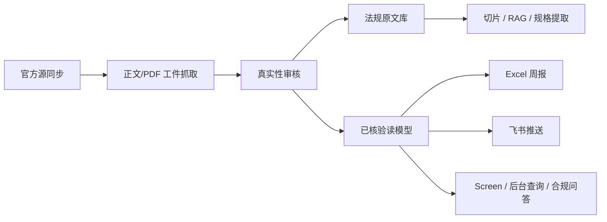

# 网安合规助手

面向海外网络设备业务的官方证据驱动合规平台。

系统目标是持续建设“全球网络安全法规、认证、标准、官方证据、规格要求”的内部知识库，并支持后台查询、地图看板、合规问答、Excel 报告和飞书推送。正式数据必须基于官方正文页、官方 PDF、官方公报、监管机构或标准机构来源；AI 只用于辅助解析本地官方文件、提取规格和基于已核验切片问答，不允许 AI 联网摘要直接进入正式知识库。

## 仓库权限

当前 GitHub 仓库如果是 `Private`，不是任何人都能直接 pull。只有以下用户能拉取：

- 仓库 owner。
- 被添加为 collaborator 的 GitHub 账号。
- 拥有可读权限的 deploy key、Personal Access Token 或组织权限的账号。

如果希望任何人都能拉取，需要在 GitHub 仓库 `Settings -> General -> Danger Zone -> Change repository visibility` 中改为 `Public`。

## 核心链路



## 数据边界

- `verified`：已核验数据，可进入正式清单、Screen、RAG、规格库、Excel 和飞书。
- `candidate`：候选线索，不作为正式结论输出。
- `suspicious`：证据不足或待复核，仅后台内部可见。
- `quarantined`：隔离数据，不参与默认查询和问答。
- AI 回答默认只读已核验数据、已入库原文切片和规格库。

## 项目结构

```text
cybersec-compliance/
├── admin/                 # FastAPI 后台接口 + Vue 前端
├── app/security/          # 加密、密钥辅助逻辑
├── collector/
│   ├── official_sources/  # 官方源发现、工件抓取、候选入库
│   ├── document/          # PDF/HTML 提取、切片、索引、RAG、规格生成
│   ├── discovery/         # AI/规则辅助发现候选
│   ├── providers/         # LLM 通道池与兼容网关
│   └── review/            # 真实性审核服务
├── database/              # 数据库连接、迁移、种子数据
├── feishu_bot/            # 飞书查询机器人
├── notifier/              # 飞书 Webhook 推送
├── reporter/              # Excel 报告生成
├── scheduler/             # 定时任务和批处理入口
├── scripts/               # 初始化、导入、诊断、维护脚本
└── tests/                 # 单元和接口测试
```

## 环境要求

- Python 3.11 或以上。
- Node.js 18 或以上。
- PostgreSQL 14 或以上。
- 建议安装 PostgreSQL 扩展：`vector`，用于 RAG 向量检索。
- 可选：腾讯云 COS、飞书机器人、OpenAI 兼容 LLM 网关。

## 快速启动

### 1. 拉取代码

```bash
git clone https://github.com/iamyourhang/cybersec-compliance.git
cd cybersec-compliance
```

如果仓库是私有仓库，请先确认你的 GitHub 账号已被添加为 collaborator。

### 2. 配置 Python 环境

```bash
python3 -m venv .venv
source .venv/bin/activate
pip install -r requirements.txt
```

### 3. 配置环境变量

```bash
cp config/.env.example config/.env
```

然后编辑 `config/.env`，至少配置：

```dotenv
DB_HOST=localhost
DB_PORT=5432
DB_NAME=cybersec_compliance
DB_USER=compliance_user
DB_PASSWORD=change_me

ADMIN_USERNAME=viewer
ADMIN_PASSWORD=change_me
ADMIN_SUPER_USERNAME=admin
ADMIN_SUPER_PASSWORD=change_me
ADMIN_JWT_SECRET=change_me_to_a_long_random_string
ADMIN_PORT=8080
```

如果需要 AI 问答、解析、规格提取，再配置以下任一 OpenAI 兼容通道：

```dotenv
UNIAPI_API_KEY=
UNIAPI_BASE_URL=https://your-openai-compatible-gateway/v1
UNIAPI_MODEL=

EMBEDDING_API_KEY=
EMBEDDING_BASE_URL=https://your-openai-compatible-gateway/v1
EMBEDDING_MODEL=text-embedding-3-small
EMBEDDING_DIMENSIONS=1536
```

如果需要飞书和报告存储，再配置：

```dotenv
FEISHU_WEBHOOK_URL=
FEISHU_WEBHOOK_SECRET=

COS_SECRET_ID=
COS_SECRET_KEY=
COS_BUCKET=
COS_REGION=
COS_REPORT_PREFIX=reports/
```

不要提交真实 `config/.env`。仓库只保留 `config/.env.example`。

### 4. 初始化数据库

如果本机没有 PostgreSQL，推荐先用 Docker 启动一个带 `pgvector` 的本地数据库：

```bash
docker compose up -d postgres
```

然后把 `config/.env` 中数据库配置设为：

```dotenv
DB_HOST=localhost
DB_PORT=5432
DB_NAME=cybersec_compliance
DB_USER=compliance_user
DB_PASSWORD=change_me
```

首次建库：

```bash
python scripts/init_db.py --superuser postgres --superpass postgres --seed
```

如果你使用的是手工安装的 PostgreSQL，把 `--superpass postgres` 改成自己的 PostgreSQL 超级用户密码。

如果数据库和用户已经存在，只执行迁移：

```bash
python scripts/init_db.py --migrate-only
```

### 5. 启动后端

```bash
uvicorn admin.api.main:app --host 0.0.0.0 --port 8080
```

访问：

```text
http://localhost:8080/
```

### 6. 前端开发模式

生产模式下 FastAPI 会直接服务 `admin/dist`。如需前端开发：

```bash
cd admin/frontend-vue
npm install
npm run dev
```

构建前端：

```bash
cd admin/frontend-vue
npm run build
```

构建产物会输出到 `admin/dist`。`admin/dist` 属于构建产物，默认不提交。

## 后台功能入口

- `Screen`：普通用户主入口，全球地图、国家详情、官方证据、合规问答。
- `合规知识库`：查看已核验法规、认证、标准和证据链。
- `法规原文`：上传 PDF/HTML、解析、切片、索引、生成规格。
- `法规问答`：后台高级 RAG 工作台。
- `审核工作台`：候选真实性审核、人工补源、隔离可疑数据。
- `官方源`：维护官方源白名单和同步历史。
- `任务管理`：手动触发官方源同步、工件抓取、文档解析、周报、预警扫描。
- `AI 通道`：维护内置 AI 通道池、优先级和额度耗尽切换。

普通用户默认只能查看知识库、原文、Screen 和问答；管理员可管理审核、任务、官方源和系统配置。

## 常用任务

### 官方源同步

```bash
python -m scheduler.main
```

或在后台 `任务管理` 页面手动触发。

### 上传本地官方原文

后台进入 `法规原文` 页面，上传官方 PDF。系统会按配置执行：

```text
上传文件 -> 提取文本 -> 文档解析 -> 切片 -> 向量/关键词索引 -> RAG 可问答
```

### 本地补源桥

当服务器访问海外官方站点失败时，可在本地下载官方 PDF/HTML，再导入服务器：

```bash
python scripts/local_official_artifact_fetch.py --input pending.jsonl --output local_artifacts/YYYYMMDD
python scripts/import_local_artifacts.py --manifest local_artifacts/YYYYMMDD/manifest.jsonl
```

### 生成 Excel 报告

后台 `任务管理` 页面触发“生成周报”，或调用对应任务接口。报告默认只导出已核验数据。

## 测试

后端测试：

```bash
pytest
```

前端构建检查：

```bash
cd admin/frontend-vue
npm run build
```

Screen 问答前端检查：

```bash
cd admin/frontend-vue
npm run test:screen-agent
```

## 部署建议

生产部署建议：

1. 使用 PostgreSQL 独立数据库。
2. `config/.env` 只放在服务器，不提交 Git。
3. 使用 systemd 管理 FastAPI 服务。
4. 使用 Nginx 做 HTTPS 反向代理。
5. 定期备份数据库和 COS 工件。
6. 普通用户只开放 `/screen` 和必要只读接口。

示例服务文件可参考：

```text
scripts/cybersec-compliance.service
```

## 安全注意事项

- 不要提交 `config/.env`、日志、COS 工件、本地下载 PDF、数据库备份。
- 不要让 AI 搜索摘要直接写入正式库。
- 不要把 `candidate/suspicious/quarantined` 作为正式查询结果展示给普通用户。
- 规格提取必须基于已入库官方原文或已核验切片。
- 如需要公开仓库，发布前再次执行敏感信息扫描。

## Legacy 约束

`scripts/run_full_update.py` 和 `scripts/ai_verify.py` 属于旧 AI 搜索链路，默认不应作为正式数据生产路径。正式数据应走：

```text
官方源 -> 原文工件 -> 真实性审核 -> 已核验读模型 -> 查询/问答/报告
```
