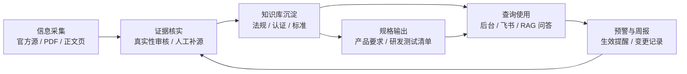

# 网安合规助手证据驱动主流程

系统主线固定为：

## 边界

- 信息采集只发现官方源、下载官方 PDF 或官方正文页，不直接产出正式知识。
- 只有证据核实闭环后的记录才能进入 `verified`，并参与 Excel、飞书、RAG 和后台默认查询。
- AI 只读取已入库的官方原文、切片和条款证据，用于解析、问答和规格提取。
- `candidate`、`suspicious`、`quarantined` 默认不进入正式导出和问答。
- 预警和周报暴露出的异常数据回流到证据核实，不直接覆盖正式库。

## 调度映射

- `official-source-sync`：信息采集。
- `artifact-fetch`：官方 PDF/正文页抓取和工件沉淀。
- `review-bucketing`：证据核实分桶，不自动放行。
- `document-parse`：官方原文解析、切片、索引。
- `spec-generate`：只对 verified 且完成索引的官方原文生成规格。
- `read-model-refresh`：刷新后台、飞书和 RAG 使用的兼容读模型。
- `weekly-report`：生成 verified-only Excel 并推送飞书。
